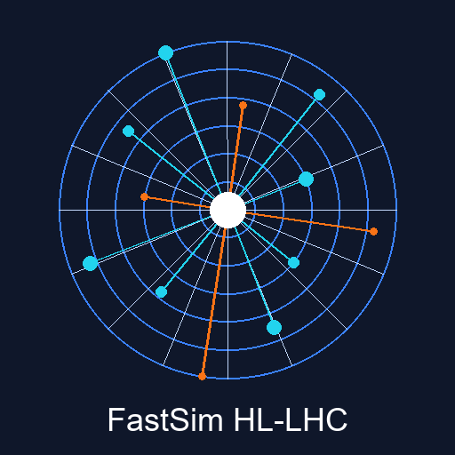

<p align="center">
  
</p>

<h1 align="center">FastSim HL-LHC</h1>

<p align="center">
  <a href="https://github.com/jardelva96/FastSim-HL-LHC/actions"></a>
  <a href="https://www.python.org/"></a>
  <a href="https://pytorch.org/"></a>
  <a href="LICENSE"></a>
</p>

<p align="center">
  Simulacao rapida de chuveiros em calorimetro com Graph Neural Networks<br>
  Projeto tecnico para candidatura a bolsa <strong>TT-IV-A</strong> (FAPESP) — processo 2022/02950-5
</p>

---

## Inicio rapido

> **Um unico comando** cria o ambiente, instala dependencias e abre a interface no navegador.

<table>
<tr>
<td width="50%">

### Windows

**Dois cliques** no `FastSim.exe` ou pelo terminal:

```powershell
.\run.bat
```

</td>
<td width="50%">

### Linux / macOS

```bash
./run.sh
```

### Ja tem o ambiente ativo?

```bash
python -m fastsim_tt4a
```

</td>
</tr>
</table>

> **Gerar o executavel:** rode `build_exe.bat` para compilar o `FastSim.exe` com icone personalizado.

---

## Visao geral

Pipeline completo de **simulacao rapida de chuveiros em calorimetro** usando
redes neurais em grafo, desde geracao de dados sinteticos ate validacao fisica
e interface interativa.

```
Dados sinteticos ──> Treino (GraphCVAE / MLP) ──> Avaliacao ──> Validacao fisica
       │                        │                       │               │
       v                        v                       v               v
  DetectorGeometry        Checkpoint (.pt)         Metricas        Perfis de
  SimulationConfig        History (.json)           JSON         camada/pileup
                          Config (.json)                        Mapas 2D energia
```

## Arquitetura dos modelos

### GraphCVAE (modelo principal)

Autoencoder variacional condicional com convolucoes em grafo:

- **Encoder**: 2 blocos `GraphConvBlock` (LayerNorm + GELU) -> pooling global -> projecao variacional (mu, logvar)
- **Latent**: Amostragem via reparametrizacao com regularizacao KL (beta-VAE)
- **Decoder**: MLP com Dropout que reconstroi energia e tempo por celula, condicionado em (z, beam_energy, pileup, coordenadas)
- **Inicializacao**: Kaiming para camadas lineares

### MLP Baseline

Autoencoder condicional sem estrutura de grafo (baseline para comparacao):

- Achata coordenadas dos nos e concatena com condicao
- Encoder/decoder simetricos com Dropout
- Serve para evidenciar o ganho do modelo em grafo

## O que este projeto entrega

- Simulacao rapida sintetica de eventos com detector em grafo (geometria configuravel)
- Treino de dois modelos (`graph_cvae` e baseline `mlp_ae`) com early stopping e scheduler
- Avaliacao com metricas de reconstrucao (MSE, vies energetico, resolucao, MAE temporal)
- Validacao fisica (perfil longitudinal, closure energetico, resolucao por faixa de pileup)
- Geracao condicionada de eventos sinteticos a partir do espaco latente
- Interface web (Streamlit) para treino, validacao e benchmark interativos
- Benchmark automatico e geracao de pacote para inscricao

## Melhorias implementadas

- **Geracao de dados vetorizada** para acelerar criacao de eventos
- **Geometria configuravel** (`n_layers`, `cells_per_layer`) com validacao de parametros
- **Treino mais robusto** com early stopping, scheduler e grad clipping
- **Regularizacao** com Dropout no encoder/decoder e inicializacao Kaiming
- **Metricas mais completas** (`mse`, vies/resolucao de energia, `time_mae`)
- **Cache de adjacencia** para evitar recomputacao da matriz do grafo
- **Desnormalizacao segura** com clamp para evitar energias negativas
- **Docstrings completas** em todos os modulos e funcoes publicas
- **Benchmark comparativo** (`graph_cvae` vs `mlp_ae`) para evidenciar criterio tecnico
- **Pacote de candidatura** gerado automaticamente com resumo + rascunho de email
- **CI multi-versao** (Python 3.10, 3.11, 3.12) com linting via ruff
- **Suite de testes abrangente** cobrindo todos os modulos do pipeline

## Estrutura

```
.
├── FastSim.exe                  # Executavel — dois cliques e roda
├── run.bat                      # Rodar tudo com 1 comando (Windows)
├── run.sh                       # Rodar tudo com 1 comando (Linux/Mac)
├── build_exe.bat                # Recompilar o executavel
├── launcher.pyw                 # Codigo-fonte do launcher
├── assets/
│   ├── logo.png                 # Logo do projeto
│   ├── icon.ico                 # Icone do executavel
│   └── generate_icon.py         # Script para regenerar icone/logo
├── src/fastsim_tt4a/
│   ├── __init__.py              # API publica do pacote
│   ├── __main__.py              # Entry-point: python -m fastsim_tt4a
│   ├── data.py                  # Geometria, simulacao e normalizacao
│   ├── model.py                 # GraphCVAE, MLP baseline e dispatchers
│   ├── metrics.py               # Metricas de reconstrucao
│   ├── train.py                 # Pipeline de treino completo
│   ├── evaluate.py              # Avaliacao de checkpoints
│   ├── validate.py              # CLI de validacao fisica
│   ├── analysis.py              # Relatorios de fisica detalhados
│   ├── benchmark.py             # Comparacao automatica de modelos
│   ├── submission.py            # Gerador de pacote de candidatura
│   └── dashboard.py             # Interface Streamlit
├── tests/
│   ├── test_data.py             # Testes de dados e geometria
│   ├── test_model.py            # Testes de modelos e loss
│   ├── test_metrics.py          # Testes de metricas
│   ├── test_train.py            # Testes end-to-end de treino
│   ├── test_evaluate.py         # Testes de avaliacao e checkpoint
│   ├── test_analysis.py         # Testes de analise fisica
│   └── test_submission.py       # Testes de geracao de pacote
├── .github/workflows/ci.yml
├── pyproject.toml
├── LICENSE
└── README.md
```

## Setup manual (alternativo)

Se preferir configurar manualmente:

```bash
python -m venv .venv

# Linux / macOS
source .venv/bin/activate

# Windows PowerShell
.\.venv\Scripts\Activate.ps1

pip install -e ".[dev,ui]"
```

## Treino (CLI)

```bash
# GraphCVAE (modelo principal)
fastsim-train --epochs 20 --num-events 6000 --batch-size 64 --n-layers 6 --cells-per-layer 16

# MLP baseline
fastsim-train --model-type mlp_ae --epochs 20 --num-events 6000 --out-dir artifacts/mlp
```

Saidas em `artifacts/`:

- `model.pt` -- checkpoint do melhor modelo
- `history.json` -- curva de treino completa
- `train_config.json` -- hiperparametros usados
- `train_summary.json` -- resumo final

## Avaliacao (CLI)

```bash
fastsim-eval --checkpoint artifacts/model.pt --num-events 1000 --out-json artifacts/eval.json
```

## Validacao fisica detalhada (CLI)

```bash
fastsim-validate --checkpoint artifacts/model.pt --num-events 1200 --out-json artifacts/validation.json
```

Saida inclui:

- Perfil por camada (energia true/pred/erro)
- Perfil por faixa de pileup (bias/resolucao)
- Closure energetico e mapas medios de energia/tempo

## Interface (Streamlit)

```bash
fastsim-dashboard
```

Abas disponiveis:

| Aba | Descricao |
|-----|-----------|
| **Treino** | Configura hiperparametros e roda treino com barra de progresso |
| **Historico** | Carrega e plota curvas de `history.json` |
| **Evento** | Inspeciona energia/tempo verdadeiros vs reconstruidos |
| **Validacao Fisica** | Metricas globais, perfis e mapas 2D detalhados |
| **Geracao** | Amostragem condicionada por energia/pileup |
| **Benchmark** | Comparacao lado a lado entre modelos |
| **Selecao** | Gera pacote final da candidatura |

## Benchmark para selecao

```bash
fastsim-benchmark --out-dir artifacts/benchmark
```

Saidas:

- `artifacts/benchmark/benchmark_results.json`
- `artifacts/benchmark/benchmark_report.md`

## Gerar pacote para enviar

```bash
fastsim-submission \
    --candidate-name "JARDEL VIEIRA ALVES" \
    --eval-json artifacts/eval.json \
    --benchmark-json artifacts/benchmark/benchmark_results.json
```

Saida: `artifacts/application_packet.md` (resumo tecnico + rascunho de e-mail)

## Testes e qualidade

```bash
# Lint
ruff check src tests

# Testes
pytest
```

## Como usar na candidatura

1. Destaque o fluxo ponta a ponta (dados -> treino -> avaliacao -> interface)
2. Mostre comparacao entre `graph_cvae` e `mlp_ae` (sinaliza metodo cientifico)
3. Inclua no email os principais numeros de `train_summary.json` e `eval.json`
4. Inclua resultado de `validation.json` para evidenciar leitura fisica do modelo
5. Mostre que o codigo esta pronto para trocar dados sinteticos por dados reais do CMS

## Licenca

MIT
